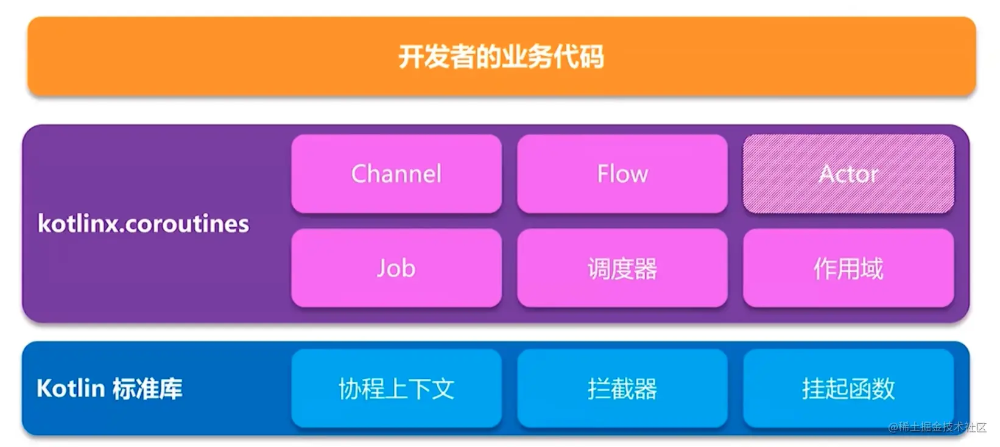

*协程必须在协程作用域中才能启动，协程作用域中定义了一些父子协程的规则，Kotlin 协程通过协程作用域来管控域中的所有协程* +

== 参考

[%hardbreaks]
https://juejin.cn/post/6942251919662383134["Kotlin"系列: 一、Kotlin入门]
https://juejin.cn/post/6950042154496425992["Kotlin"系列: 二、Kotlin泛型]
https://juejin.cn/post/6963190541471186957["Kotlin"系列: 三、Kotlin协程(上)]
https://github.com/Kotlin/kotlinx.coroutines[Kotlin 协程库]
https://doc.devio.org/as/book/docs/Part1/Android%E5%BC%80%E5%8F%91%E5%BF%85%E5%A4%87Kotlin%E6%A0%B8%E5%BF%83%E6%8A%80%E6%9C%AF/KotlinExtensions.html[让人爱不释手的Kotlin扩展（Extensions）技术探Extensions秘与应用]
